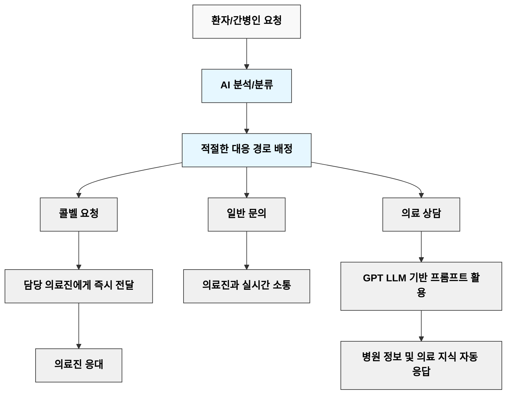

# 
🏥 CareBridge

<i>간호간병통합서비스 플랫폼</i>

  
  <h3>병원 입원 생활을 더 스마트하게, 더 편리하게</h3>
  
  
  
  
  

## 📋 프로젝트 소개

> **CareBridge**는 입원 환자들의 병원 생활을 보다 편안하고 효율적으로 지원하는 **간호간병 통합 컨시어지 지원 플랫폼**입니다. 환자와 의료진 간의 원활한 의사소통을 도모하고, 병원의 의료 서비스 효율성을 극대화하며, 환자 만족도를 향상시키는 것을 목표로 합니다.

 

## 🎯 핵심 기능

<table style="width: 100%; border-collapse: separate; border-spacing: 0 10px;">
  <tr>
    <td width="50%" style="padding: 15px; vertical-align: top;">
      <h3>📱 스마트 콜벨 서비스</h3>
      <ul>
        <li>환자와 간병인이 메시지 기반으로 필요한 서비스(식사, 청소, 간호 등)를 요청하면 AI가 자동 분류</li>
        <li>요청 유형에 따라 적절한 처리 경로로 자동 분배:
          <ul>
            <li>콜벨 요청: 담당 의료진에게 즉시 전달</li>
            <li>일반 문의: 의료진과 실시간 소통</li>
            <li>의료 상담: ChatGPT LLM 기반 프롬프트를 통해 정보 자동 응답</li>
          </ul>
        </li>
      </ul>
    </td>
    <td width="50%" style="padding: 15px; vertical-align: top;">
      <h3>🏥 입원 생활 편의성 향상</h3>
      <ul>
        <li>입퇴원 절차, 병실 생활 정보, 의료 행정 서비스 등의 정보를 쉽게 확인</li>
        <li>환자 맞춤형 정보와 서비스를 원스톱으로 제공하는 통합 플랫폼</li>
      </ul>
    </td>
  </tr>
  <tr>
    <td style="padding: 15px; vertical-align: top;">
      <h3>🩺 의료 정보 전달 효율화</h3>
      <ul>
        <li>진료 및 검사 일정, 검진 전 주의사항 등을 환자와 간병인에게 사전 알림</li>
        <li>의료진이 반복적인 문의와 절차에서 벗어나 본연의 의료 서비스에 집중할 수 있도록 지원</li>
      </ul>
    </td>
    <td style="padding: 15px; vertical-align: top;">
      <h3>📚 AI 기반 지능형 환자 케어 시스템</h3>
      <ul>
        <li>Chat GPT Open API 활용 챗봇으로 24시간 정보 제공 및 기초 상담 지원</li>
        <li>환자-의료진 간 실시간 소통 채널 확보</li>
        <li>병원 정보 및 저장된 데이터를 기반으로 맞춤형 응답 제공</li>
        <li>중요 정보의 실시간 푸시 알림 서비스</li>
      </ul>
    </td>
  </tr>
</table>

 

## 💡 서비스 흐름도

 

## 🛠️ 기술 스택

| 분류 | 기술 |
|:---:|:---:|
| **프레임워크** |   |
| **데이터베이스** |   |
| **보안** |   |
| **실시간 통신** |   |
| **알림 서비스** |  |
| **API 문서화** |  |
| **AI 통합** |  |

 

## 📊 기대 효과

<table>
  <tr>
    <td align="center"><b>👨‍⚕️ 환자 만족도 향상</b></td>
    <td>신속한 응대와 개인화된 서비스 제공</td>
  </tr>
  <tr>
    <td align="center"><b>🏥 의료진 업무 효율화</b></td>
    <td>반복 업무 감소 및 핵심 의료 서비스 집중</td>
  </tr>
  <tr>
    <td align="center"><b>⚙️ 병원 운영 최적화</b></td>
    <td>자원 배분 효율화 및 서비스 질 향상</td>
  </tr>
  <tr>
    <td align="center"><b>🔬 디지털 헬스케어 혁신</b></td>
    <td>스마트 병원 환경 구축 기여</td>
  </tr>
</table>

 

## 📖 API 문서

  

 

## 🧑‍💻 개발팀

  
> CareBridge는 한양대학교 ERICA 캠퍼스 캡스톤 프로젝트로 개발되었습니다.

| 이름 | 역할 |
|:---:|:---:|
| 박세현 | 백엔드 개발 |
| 성동진 | 백엔드 개발 |
| 강민경 | 프론트엔드 개발 |
| 김채현 | 프론트엔드 개발 |
| 문민영 | 프론트엔드 개발 |

 

## 📄 라이센스

  
본 프로젝트는 비공개 캡스톤 프로젝트로, 모든 권리가 개발팀에게 있습니다.

© 2024 CareBridge Team. All Rights Reserved.

